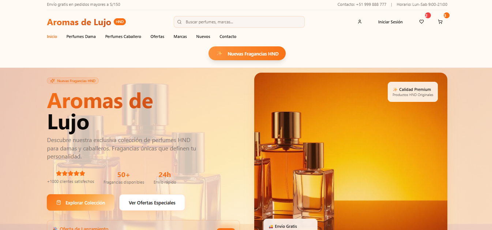

# Bienvenido a tu proyecto Lovable

## Información del proyecto

**URL**: https://lovable.dev/projects/c933ffc3-51a7-4f3f-b904-8ffbd95310a6

## ¿Cómo puedo editar este código?

Hay varias formas de editar tu aplicación.

**Usa Lovable**

Simplemente visita el [Proyecto Lovable](https://lovable.dev/projects/c933ffc3-51a7-4f3f-b904-8ffbd95310a6) y empieza a solicitar.

Los cambios realizados a través de Lovable se confirmarán automáticamente en este repositorio.

**Usa tu IDE preferido**

Si quieres trabajar localmente usando tu propio IDE, puedes clonar este repositorio y subir los cambios. Los cambios subidos también se reflejarán en Lovable.

El único requisito es tener Node.js y npm instalados - [instalar con nvm](https://github.com/nvm-sh/nvm#installing-and-updating)

Sigue estos pasos:

```sh
# Paso 1: Clona el repositorio usando la URL de Git del proyecto.
git clone <TU_URL_GIT>

# Paso 2: Navega al directorio del proyecto.
cd <TU_NOMBRE_DE_PROYECTO>

# Paso 3: Instala las dependencias necesarias.
npm i

# Paso 4: Inicia el servidor de desarrollo con recarga automática y una vista previa instantánea.
npm run dev
```

**Edita un archivo directamente en GitHub**

- Navega al/los archivo(s) deseado(s).
- Haz clic en el botón "Editar" (icono de lápiz) en la parte superior derecha de la vista del archivo.
- Realiza tus cambios y confirma los cambios.

**Usa GitHub Codespaces**

- Navega a la página principal de tu repositorio.
- Haz clic en el botón "Código" (botón verde) cerca de la parte superior derecha.
- Selecciona la pestaña "Codespaces".
- Haz clic en "Nuevo codespace" para iniciar un nuevo entorno de Codespace.
- Edita los archivos directamente dentro del Codespace y confirma y sube tus cambios una vez que hayas terminado.

## ¿Qué tecnologías se utilizan para este proyecto?

Este proyecto está construido con:

- Vite
- TypeScript
- React
- shadcn-ui
- Tailwind CSS

## ¿Cómo puedo desplegar este proyecto?

Simplemente abre [Lovable](https://lovable.dev/projects/c933ffc3-51a7-4f3f-b904-8ffbd95310a6) y haz clic en Compartir -> Publicar.

## ¿Puedo conectar un dominio personalizado a mi proyecto Lovable?

¡Sí, puedes!

Para conectar un dominio, navega a Proyecto > Configuración > Dominios y haz clic en Conectar Dominio.

Lee más aquí: [Configurar un dominio personalizado](https://docs.lovable.dev/tips-tricks/custom-domain#step-by-step-guide)


